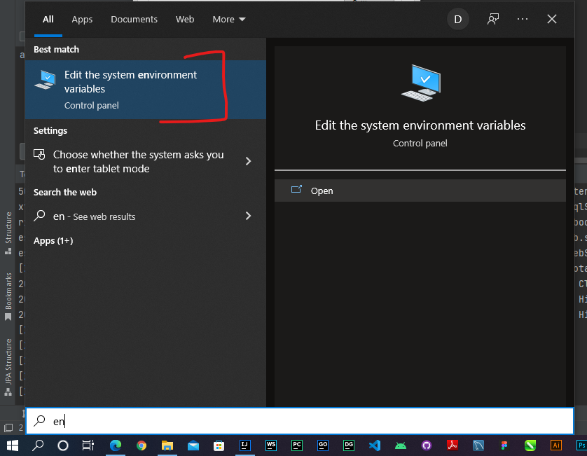
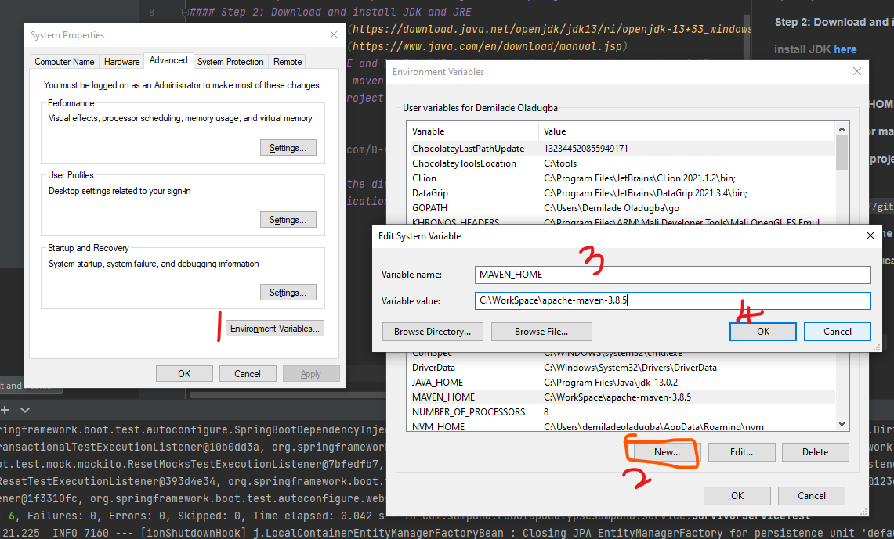
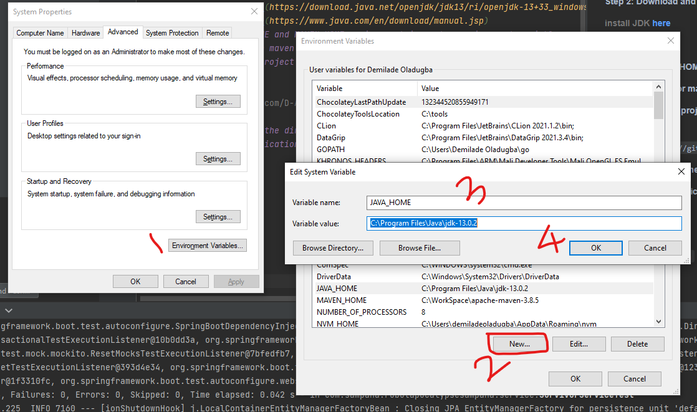
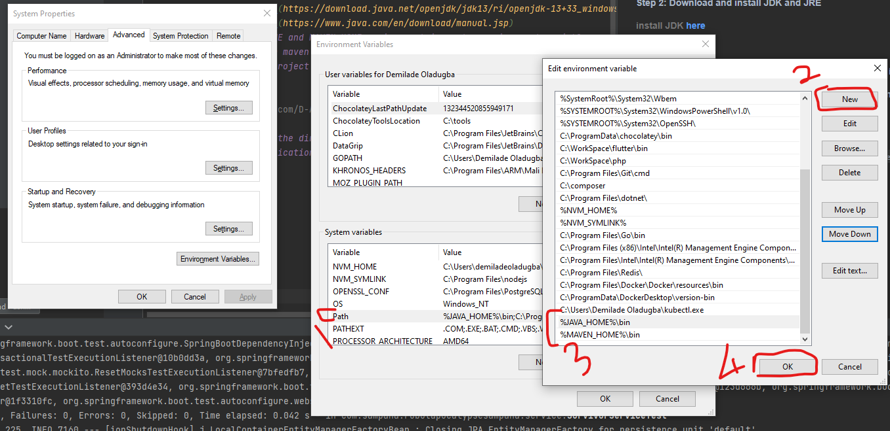

# ROBOT APOCALYPSE

### How to Run This Application

#### Step 1: SetUp Maven (Ignore if already setup)
###### a) Install maven from [here](https://maven.apache.org/download.cgi)
###### b) Unzip maven and keep in C drive (you can keep any location. Path location will be changed accordingly).
#### Step 2: Download and install JDK and JRE
###### install JDK [here](https://download.java.net/openjdk/jdk13/ri/openjdk-13+33_windows-x64_bin.zip)
###### install JRE [here](https://www.java.com/en/download/manual.jsp)
#### Step 3: Set JAVA_HOME and MAVEN_HOME environment in system environment variable
###### a) Open environment variable


###### b) Add MAVEN_HOME to environment variable


###### c) Add JAVA_HOME to environment variable


#### Step 4: Set Path for maven and java in system environment variable


#### Step 5: Clone this project
Open CMD and run <br/> 
`
git clone https://github.com/D-Alegria/robot-apocalypse-sampana.git
`
#### Step 5: Navigate to the directory in your terminal
#### Step 6: Run the Application in your terminal
###### a) Clean and Install
`mvn clean install 
`
###### b) Run
`mvn spring-boot:run
`


## APIS
#### Add Survivor
```curl
curl -L -X POST "http://localhost:8080/api/v1/survivor" ^
-H "Content-Type: application/json" ^
--data-raw "{ \"name\": \"Akon Zulu\", \"age\": 40, \"gender\": \"Male\", \"location\": { \"longitude\": 100.00, \"latitude\": 150.00 } }"
```

#### Update Survivor Location
```curl
curl -L -X PUT "localhost:8080/api/v1/survivor/location/15e41515-1aa3-4194-9435-" ^
-H "Content-Type: application/json" ^
--data-raw "{    \"longitude\": 1000.00,  \"latitude\": 1780.00}"
```

#### Report Infected
```curl
curl -L -X POST "localhost:8080/api/v1/survivor/report/infected" ^
-H "Content-Type: application/json" ^
--data-raw "{\"infectedUuid\": \"52aa13ab-de7c-4a7c-b450-208e4f5e4bab\",\"informantUuid\": \"998b76ef-7a09-4954-ad6f-fdb65c2508a5\"}"
```

#### Get All Robots
```curl
curl -L -X GET "localhost:8080/api/v1/robot"
```

#### Get current Report
```curl
curl -L -X GET "localhost:8080/api/v1/report"
```
